# 数字管网管线

    

        

            自动化三维重建
        

        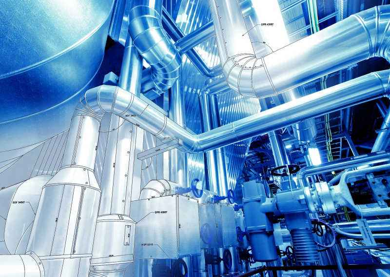
        

            通过结构化管道原始数据，形成自动计算、自动生成、自动加载的三维管道。
        

    

    

        

            跨平台部署
        

        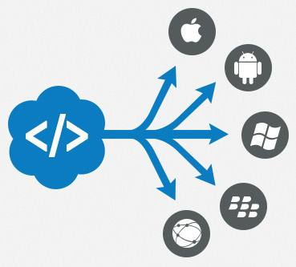
        

            系统底层基于WebGL 2.0开发，能够做到无视系统平台运行。
        

    

    

        

            多维数据开放平台
        

        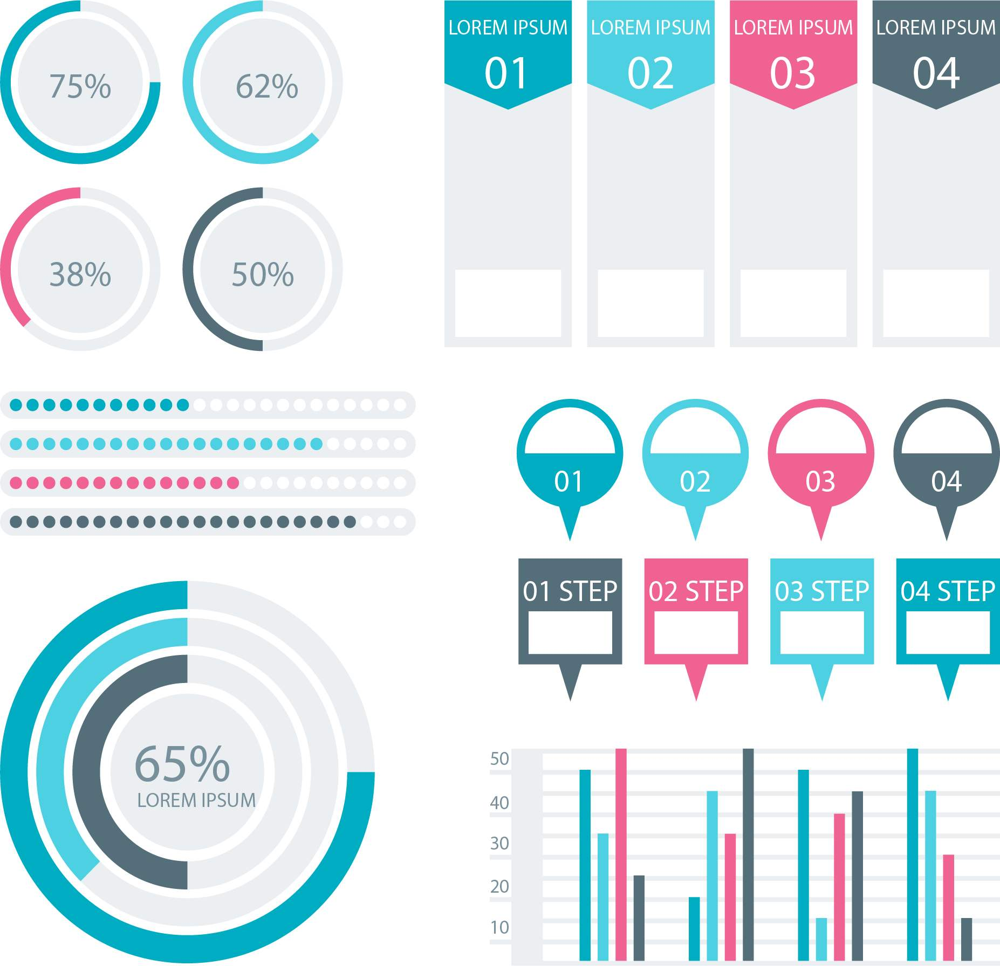
        

            兼容多重通讯协议能够有效结合管道数据提供整体解决方案。
        

    

    

        

            无监管算法模型
        

        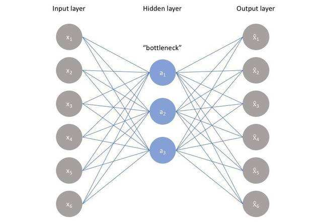
        

            联合四川大学、电子科技大学等多家名校教授联合开发管道深度学习算法。
        

    

# 智慧园区管理系统

    

        

            完善业务管理系统
        

        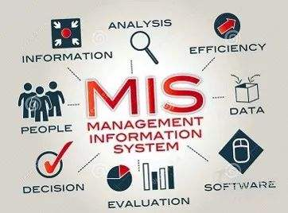
        

            提供详细完善的业务管理平台，提供人员、车辆、资产、财务、企业等多维度完善管理方案。
        

    

    

        

            园区三维可视化
        

        
        

            对园区创建三维展示平台，集成园区道路、建筑等三维模型对园区整体进行三维展示
        

    

    

        

            轨迹溯源
        

        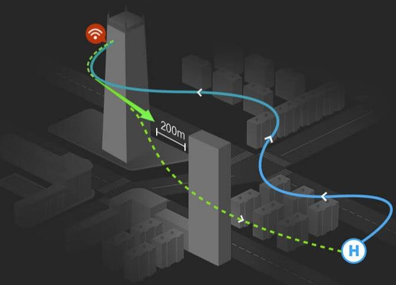
        

            通过物联网设备以通行证方式实时记录人员、车辆位置结合三维可视化场景提供监管溯源系统。
        

    

    

        

            全方位监控预警
        

        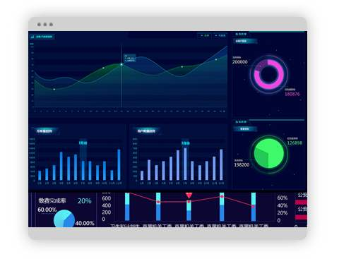
        

            通过多种监控设备结合三维场景，通过人脸识别、行为分析、环境状态分析等算法提供全方位监控预警服务。
        

    

# 城市GIS系统

    

        

            矢量地图数据
        

        
        

            系统自带完全本地化的全球矢量地图数据，提供高性能、无损的地图数据。
        

    

    

        

            可编辑地图引擎
        

        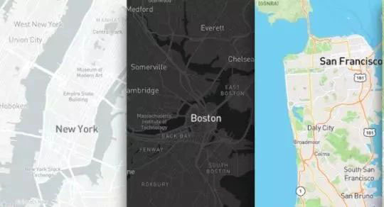
        

            提供完善的编辑器实现对地图样式的高度自定义。
        

    

    

        

            DEM高程数据
        

        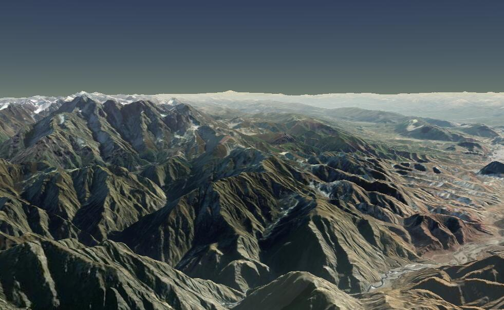
        

            结合全球DEM高程图数据实现地图组件的全面三维化。
        

    

    

        

            多重数据展现形态
        

        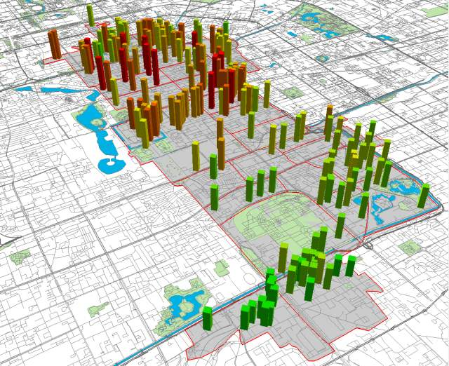
        

            在底层组件支撑下地图能够轻易拓展道路信息、车辆信息、建筑信息、定位信息等多维度数据。
        

    

# VHome装修平台

    

        

            实时渲染
        

        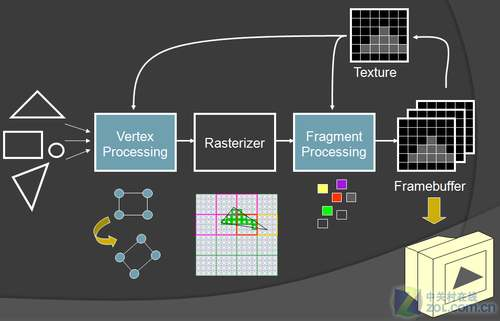
        

            系统提供基于物理的实时渲染工作流，用户无需等待漫长的渲染调整过程，所见即所得。
        

    

    

        

            模型材质商城
        

        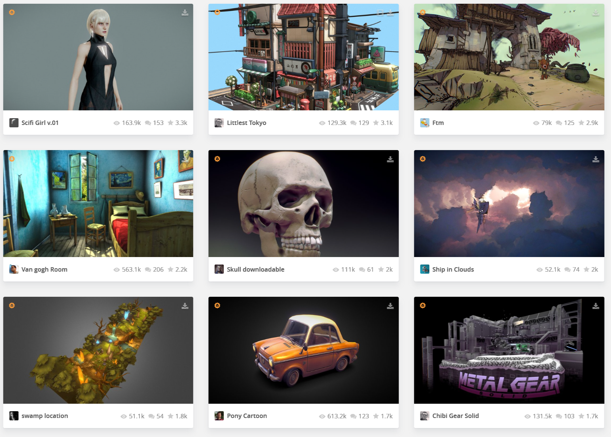
        

            用户可用通过模型商场自由购买、下载、使用模型资源，同时可将自己的模型上传至商城售卖。
        

    

    

        

            模型工具
        

        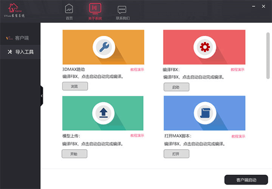
        

            系统提供完善的模型工具，使用者可以通过工具将自建模型或第三方模型导入系统使用。
        

    

    

        

            功能强大的编辑器
        

        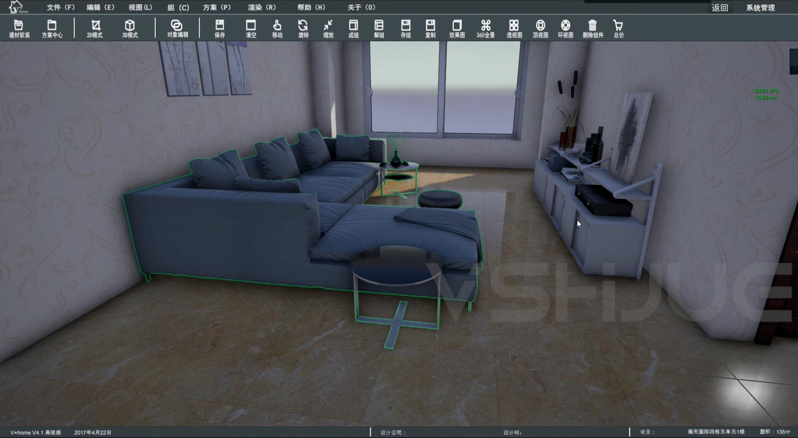
        

            通过编辑器用户能够对灯光、墙体、门窗、材质、模型等场景所有元素进行实时动态的编辑修改。
        

    

